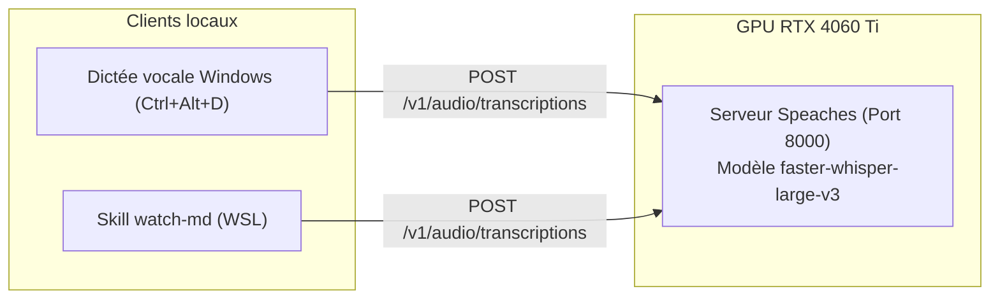

# whisper-dictation

**Client de dictée vocale globale avec raccourci clavier connecté à un serveur Whisper local partagé sur GPU.**


## Architecture

Le projet repose sur une architecture client-serveur locale optimisée :
- **Serveur Whisper (Docker Speaches)** : Tourne sur le port `8000` et charge le modèle `faster-whisper-large-v3` sur GPU CUDA (RTX 4060 Ti). Il est partagé sans conflit avec les compétences WSL (`watch-md`).
- **Client de dictée (Windows)** : Écoute globale via l'API Win32 `RegisterHotKey` (`Ctrl + Alt + D`), capture microphone en mémoire, envoi HTTP ultra-rapide et insertion automatique du texte au niveau du curseur.
- **Gestion de la VRAM** : Scripts de contrôle permettant de couper ou relancer le service en 1 clic pour libérer 100% de la mémoire GPU (jeux, LLM).



> Détails complets : [docs/CADRAGE.md](docs/CADRAGE.md) et [docs/ARCHITECTURE.md](docs/ARCHITECTURE.md)

## Documentation

| Document | Contenu |
|---|---|
| [docs/CADRAGE.md](docs/CADRAGE.md) | Objectifs, périmètre, arbitrages et gestion VRAM |
| [docs/ARCHITECTURE.md](docs/ARCHITECTURE.md) | Flux de bout en bout, diagrammes Mermaid, composants |

## Utilisation au quotidien

### 1. Démarrer une dictée
1. Placez votre curseur dans n'importe quelle application (chat, VS Code, navigateur, traitement de texte).
2. Appuyez sur **`Ctrl + Alt + D`** : un bip aigu confirme le début de l'écoute.
3. Dictez votre phrase.
4. Réappuyez sur **`Ctrl + Alt + D`** : un bip confirme la fin, le calcul s'exécute sur le GPU et le texte est collé instantanément au curseur.

### 2. Démarrage automatique au boot Windows
* **Zéro action requise** : Le conteneur Docker et le client de dictée sont configurés pour démarrer automatiquement avec votre session Windows (via le dossier `shell:startup`). Dès l'allumage du PC, le raccourci `Ctrl + Alt + D` est opérationnel en arrière-plan sans ouvrir de fenêtre.

### 3. Contrôle manuel du service (Libérer la VRAM GPU)

Pour libérer l'intégralité des 16 Go de VRAM de la carte graphique (lancement d'un jeu vidéo ou d'un gros modèle LLM) :
- **Couper le service** : double-cliquez sur **`Arreter-Service-Dictee.bat`** (à la racine). Le client et le serveur Whisper sont éteints, la mémoire GPU est 100% libérée.
- **Relancer le service** : double-cliquez sur **`Lancer-Service-Dictee.vbs`** (à la racine). Le service démarre en arrière-plan avec zéro fenêtre de terminal.

## Configuration

La configuration s'effectue via le fichier `.env` :

| Variable | Défaut | Effet |
|---|---|---|
| `WHISPER_BASE_URL` | `http://localhost:8000/v1` | URL de l'API Whisper |
| `WHISPER_MODEL` | `Systran/faster-whisper-large-v3` | Modèle Whisper utilisé |
| `WHISPER_LANGUAGE` | `fr` | Langue principale pour la transcription |
| `DICTATION_HOTKEY` | `<ctrl>+<alt>+d` | Raccourci clavier global principal |
| `AUDIO_FEEDBACK` | `true` | Activation des bips sonores de confirmation |
| `INITIAL_PROMPT` | *(liste de termes tech)* | Guide pour l'orthographe des acronymes et anglicismes |

## Tests

```bash
uv run pytest -v
```

## Structure du projet

```text
whisper-dictation/
├── .env.example                  # Modèle de configuration
├── .gitignore
├── pyproject.toml                # Configuration du projet et dépendances uv
├── README.md                     # Documentation principale
├── Lancer-Service-Dictee.vbs     # Lanceur 100% invisible sans fenêtre
├── Arreter-Service-Dictee.bat    # Arrêt du service et libération VRAM
├── docs/
│   ├── CADRAGE.md                # Cadrage et arbitrages techniques
│   └── ARCHITECTURE.md           # Architecture détaillée et flux
├── scripts/
│   ├── start_server.sh           # Démarrer le serveur Whisper sous WSL
│   ├── stop_server.sh            # Arrêter le serveur et libérer la VRAM
│   ├── whisper-start.bat         # Lanceur de démarrage du serveur
│   ├── whisper-stop.bat          # Lanceur d'arrêt du serveur
│   └── run_silent.vbs            # Script VBScript sous-jacent
├── src/
│   └── whisper_dictation/
│       ├── __init__.py
│       ├── audio.py              # Capture microphone (sounddevice / WAV)
│       ├── client.py             # Client API HTTP Whisper
│       ├── config.py             # Paramètres et validation pydantic
│       ├── feedback.py           # Signaux sonores discrets
│       ├── hotkey.py             # Écouteur natif Win32 RegisterHotKey
│       ├── injector.py           # Injection de texte et collage
│       ├── main.py               # Point d'entrée CLI et boucle de messages
│       └── server_manager.py     # Contrôle du conteneur Docker
└── tests/
    ├── __init__.py
    ├── test_audio.py             # Tests du module audio
    ├── test_client.py            # Tests du client HTTP et simulation
    ├── test_config.py            # Tests des paramètres
    └── test_injector.py          # Tests d'injection de texte
```

## Licences & composants

| Composant | Rôle | Licence |
|---|---|---|
| `httpx` | Client HTTP asynchrone / synchrone | BSD-3-Clause |
| `sounddevice` | Capture audio microphone | MIT |
| `numpy` | Manipulation des tableaux audio | BSD-3-Clause |
| `pydantic` | Validation de données et configuration | MIT |
| `speaches` | Serveur Whisper conteneurisé | MIT |
| `faster-whisper` | Moteur de transcription CTranslate2 | MIT |
| **Ce projet** | Code applicatif de dictée | MIT — Copyright (c) 2026 floSa |
