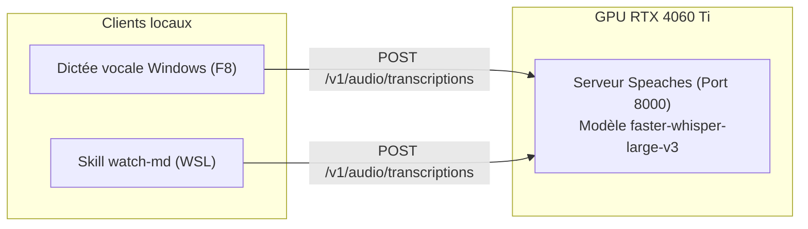

# whisper-dictation

**Client de dictée vocale globale avec raccourci clavier connecté à un serveur Whisper local partagé sur GPU.**


## Architecture

Le projet repose sur une architecture client-serveur locale optimisée :
- **Serveur Whisper (Docker Speaches)** : Tourne sur le port `8000` et charge le modèle `faster-whisper-large-v3` sur GPU CUDA (RTX 4060 Ti). Il est partagé sans conflit avec les compétences WSL (`watch-md`).
- **Client de dictée (Windows)** : Écoute globale d'un raccourci clavier (`F8`), capture microphone en mémoire, envoi HTTP ultra-rapide et insertion automatique du texte au niveau du curseur.
- **Gestion de la VRAM** : Scripts de contrôle permettant d'arrêter le conteneur en 1 seconde pour libérer 100% de la mémoire GPU (jeux, LLM).



> Détails complets : [docs/CADRAGE.md](docs/CADRAGE.md) et [docs/ARCHITECTURE.md](docs/ARCHITECTURE.md)

## Documentation

| Document | Contenu |
|---|---|
| [docs/CADRAGE.md](docs/CADRAGE.md) | Objectifs, périmètre, arbitrages et gestion VRAM |
| [docs/ARCHITECTURE.md](docs/ARCHITECTURE.md) | Flux de bout en bout, diagrammes Mermaid, composants |

## Démarrage rapide

**Prérequis** : Windows 11 avec WSL 2, Docker et `uv` installés.

```bash
# 1. Cloner et installer les dépendances avec uv
cd whisper-dictation
uv sync

# 2. Démarrer le serveur Whisper local (si pas déjà actif)
./scripts/start_server.sh      # sous Linux/WSL
# ou double-cliquer sur scripts/whisper-start.bat sous Windows

# 3. Lancer le client de dictée
uv run whisper-dictation run
```

## Utilisation

1. Placez votre curseur dans n'importe quelle application (VS Code, navigateur, traitement de texte).
2. Appuyez sur **`F8`** : un bip aigu confirme le début de l'écoute.
3. Dictez votre phrase.
4. Réappuyez sur **`F8`** : un bip de fin retentit, la transcription s'exécute sur le GPU et le texte est collé instantanément au curseur.

### Gestion de la mémoire GPU (VRAM ON/OFF)

Pour libérer l'intégralité des 16 Go de VRAM de la carte graphique (lancement d'un jeu vidéo ou d'un gros modèle LLM) :
- **Arrêter le serveur** : double-cliquer sur `scripts/whisper-stop.bat` (ou lancer `./scripts/stop_server.sh`).
- **Relancer le serveur** : double-cliquer sur `scripts/whisper-start.bat` (ou `./scripts/start_server.sh`).

### Démarrage automatique avec Windows

Pour que la dictée soit prête dès l'allumage du PC :
1. Ouvrez l'explorateur Windows et tapez `shell:startup` dans la barre d'adresse.
2. Créez un raccourci vers `scripts/run_silent.vbs`.

## Configuration

La configuration s'effectue via le fichier `.env` :

| Variable | Défaut | Effet |
|---|---|---|
| `WHISPER_BASE_URL` | `http://localhost:8000/v1` | URL de l'API Whisper |
| `WHISPER_MODEL` | `Systran/faster-whisper-large-v3` | Modèle Whisper utilisé |
| `WHISPER_LANGUAGE` | `fr` | Langue principale pour la transcription |
| `DICTATION_HOTKEY` | `<f8>` | Raccourci clavier global (ex: `<ctrl>+<alt>+<space>`) |
| `DICTATION_MODE` | `toggle` | Mode d'enregistrement (`toggle` ou `push_to_talk`) |
| `AUDIO_FEEDBACK` | `true` | Activation des bips sonores de confirmation |
| `INITIAL_PROMPT` | *(liste de termes tech)* | Guide pour l'orthographe des acronymes et anglicismes |

## Tests

```bash
uv run pytest -v
```

## Structure du projet

```text
whisper-dictation/
├── .env.example               # Modèle de configuration
├── .gitignore
├── pyproject.toml             # Configuration du projet et dépendances uv
├── README.md                  # Documentation principale
├── docs/
│   ├── CADRAGE.md             # Cadrage et arbitrages techniques
│   └── ARCHITECTURE.md        # Architecture détaillée et flux
├── scripts/
│   ├── start_server.sh        # Démarrer le serveur Whisper sous WSL
│   ├── stop_server.sh         # Arrêter le serveur et libérer la VRAM
│   ├── whisper-start.bat      # Lanceur Windows pour démarrer le serveur
│   ├── whisper-stop.bat       # Lanceur Windows pour libérer la VRAM
│   └── run_silent.vbs         # Lanceur silencieux au boot Windows
├── src/
│   └── whisper_dictation/
│       ├── __init__.py
│       ├── audio.py           # Capture microphone (sounddevice / WAV)
│       ├── client.py          # Client API HTTP Whisper
│       ├── config.py          # Paramètres et validation pydantic
│       ├── feedback.py        # Signaux sonores discrets
│       ├── injector.py        # Injection de texte et collage
│       ├── main.py            # Point d'entrée CLI et écouteur global
│       └── server_manager.py  # Contrôle du conteneur Docker
└── tests/
    ├── __init__.py
    ├── test_audio.py          # Tests du module audio
    ├── test_client.py         # Tests du client HTTP et simulation
    ├── test_config.py         # Tests des paramètres
    └── test_injector.py       # Tests d'injection de texte
```

## Licences & composants

| Composant | Rôle | Licence |
|---|---|---|
| `httpx` | Client HTTP asynchrone / synchrone | BSD-3-Clause |
| `sounddevice` | Capture audio microphone | MIT |
| `numpy` | Manipulation des tableaux audio | BSD-3-Clause |
| `pynput` | Écoute des raccourcis globaux | LGPL-3.0 |
| `pydantic` | Validation de données et configuration | MIT |
| `speaches` | Serveur Whisper conteneurisé | MIT |
| `faster-whisper` | Moteur de transcription CTranslate2 | MIT |
| **Ce projet** | Code applicatif de dictée | MIT — Copyright (c) 2026 floSa |
