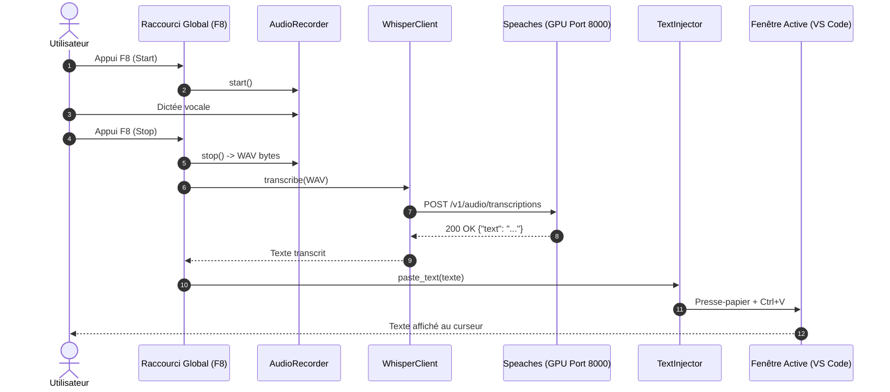
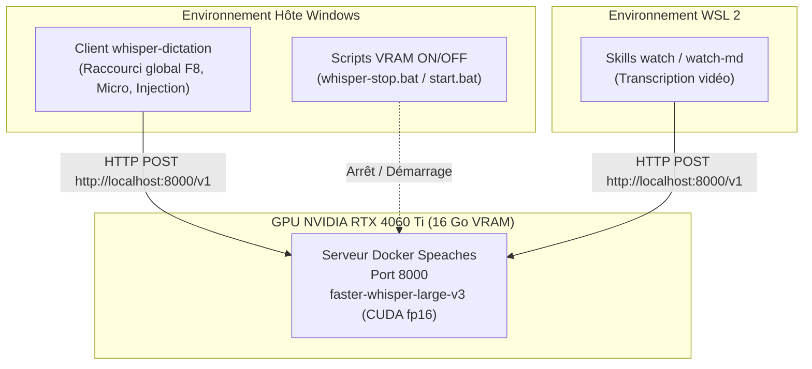

# Architecture — whisper-dictation

## 1. Vue d'ensemble

`whisper-dictation` est composé d'un client léger d'écoute clavier et capture microphone sous Windows, communiquant via HTTP avec un serveur d'inférence Whisper (`speaches`) exécuté dans un conteneur Docker accéléré par GPU CUDA. Le serveur est partagé sans duplication de mémoire avec les compétences de transcription de vidéos (`watch-md`).

---

## 2. Services / Composants

| Service / Module | Type | Port | Rôle |
|---|---|---|---|
| `speaches` (Docker) | Conteneur GPU | `8000` | Inférence Whisper (`faster-whisper-large-v3`) sous CUDA fp16 |
| `whisper_dictation.audio` | Module Python | - | Capture du flux microphone et conversion en WAV 16 kHz |
| `whisper_dictation.client` | Module Python | - | Requête HTTP POST vers `/v1/audio/transcriptions` |
| `whisper_dictation.injector` | Module Python | - | Copie presse-papier et simulation de frappe Ctrl+V |
| `whisper_dictation.feedback` | Module Python | - | Signaux sonores d'état (début, fin, validation, erreur) |
| `whisper_dictation.server_manager` | Module Python | - | Contrôle de la VRAM (arrêt/démarrage du conteneur) |

---

## 3. Stack technologique

| Couche | Technologie | Version |
|---|---|---|
| Langage | Python | 3.12 |
| Gestionnaire | uv | >=0.10.0 |
| Client HTTP | HTTPX | >=0.27.0 |
| Raccourcis | pynput | >=1.7.6 |
| Moteur IA | Speaches / Faster-Whisper | latest-cuda |
| Inférence GPU | CUDA / CTranslate2 | fp16 |

---

## 4. Flux de bout en bout

---

## 5. Réseau & Architecture partagée

---

## 6. Décisions d'architecture

- **Architecture Client-Serveur locale** : Choisi **plutôt que** d'embarquer le modèle Whisper dans le process Python de dictée, **parce que** cela permet de partager le modèle unique en VRAM avec les scripts WSL (`watch-md`) et d'éviter un temps de chargement de 5 secondes à chaque dictée.
- **Accélération CUDA FP16** : Choisi **plutôt que** l'émulation CPU INT8, **parce que** la RTX 4060 Ti traite l'audio en moins de 300 ms avec une consommation mémoire contenue (~3.5 Go).
- **Communication par buffer mémoire** : Choisi **plutôt que** le stockage de fichiers audio sur disque, **parce que** cela garantit la confidentialité, supprime les entrées/sorties disque et réduit la latence.

---

## 7. Sécurité & Confidentialité

- **100% Hors-ligne** : Aucune donnée audio ni texte ne transite sur Internet.
- **API locale non exposée** : Le serveur écoute sur `localhost` / `127.0.0.1`.
- **Gestion des secrets** : Aucune clé d'API distante requise.

---

## 8. Limites connues & pistes

| Aspect | Limitation / État | Recommandation |
|---|---|---|
| Conflit de raccourci | Si une application capture exclusivement `F8` | Modifier `DICTATION_HOTKEY` dans `.env` (ex: `<ctrl>+<alt>+<space>`) |
| Serveur éteint | Si le serveur est arrêté pour libérer la VRAM | Le client émet un bip d'erreur et indique la commande de relance |
| Micro sous WSL | Exécuter le client sous Windows | Le client de dictée tourne nativement sous Windows pour un accès direct au micro |
